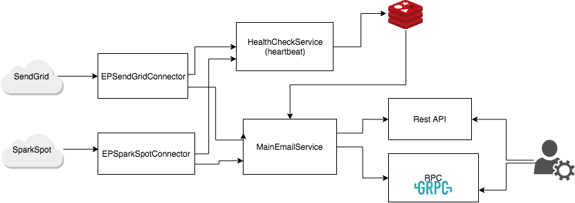

# AKEmailService 
* including 
	* docker
	* backend service
Email Service

## Questions 
* Is there any periority of using the service ?
* What Happen when profider go down?
	* Failover to the other 
		* what happen when old provider come back 
		* what happen when the new provider go down

## steps 
* build docker image 
* Run docker compose 
	* Run Redis container
	* Run Rest API Service 
	* Run RPC Service
	* Run Health check(heartbeat) searvice 
* User Rest API
	* check api docs /apidocs
	* /api/auth to get token
	* /api/email [POST] with JWT token
* Use RPC client


## High level architecture



### Email Providers 
	* sendgrid
	* sparkpost

## Init
## config 
### Email Providers connectors 
```
	sendgrid:
	    API_KEY: "<YOUR_API_KEY>"
	    STATUS_URL: "http://status.sendgrid.com/api/v2/summary.json"
	    COMPONENT_NAME: "Mail Sending"
	sparkpost:
	    API_KEY: "<YOUR_API_KEY>"
	    STATUS_URL: "https://status.sparkpost.com/api/v2/summary.json"
	    COMPONENT_NAME: "Transmissions API"
```
## Running Pre Requirements
#### Option 1 (Recommended)
	* Docker
	* Docker-compose
#### Option 2
	* Redis server 
		* REDIS_HOST = "ak-redis"
		* REDIS_PORT = 6379
	* Python 3.X
	* pip and python requirements in requirements.txt
	* Run each service separately 
## Code Dir Tree
	./
		MainService/    <Your main Flask  code dir> 
		Readme.md
		docker-entrypoint.sh
		..
## Getting Start
* clone this repo
	
* Build The images
```
    cd $PWD
    
	sh build_docker_image.sh 

```

* Start Container On Dev Mode 
```
	sh run_ak_dev.sh
```

#### Start Container On Pro Mode 
```
	docker-compose up
```

