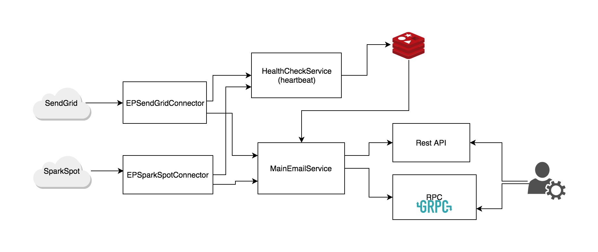
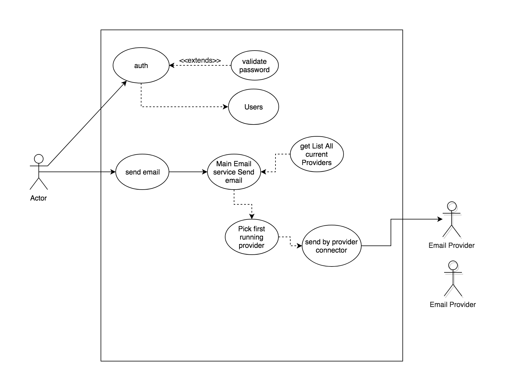
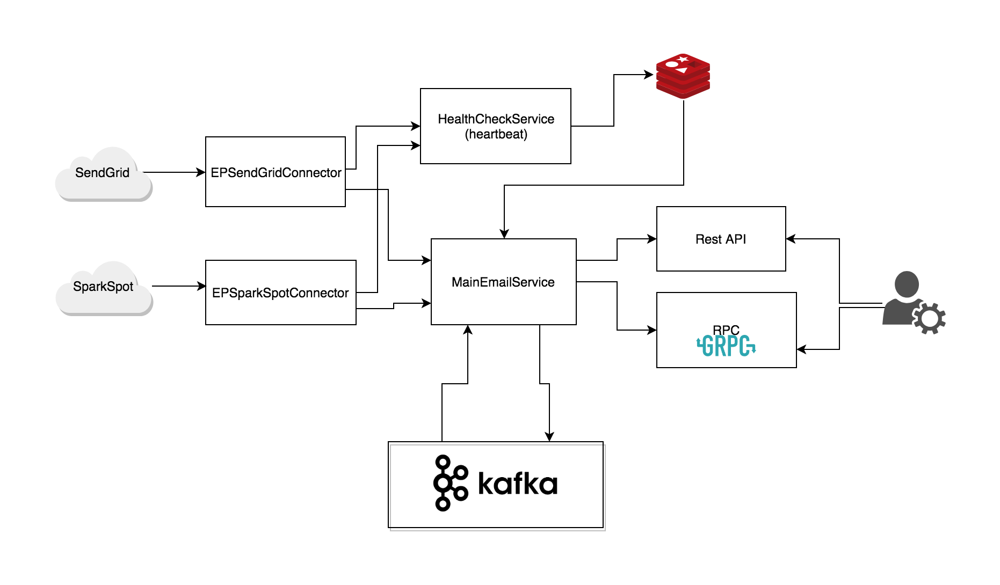
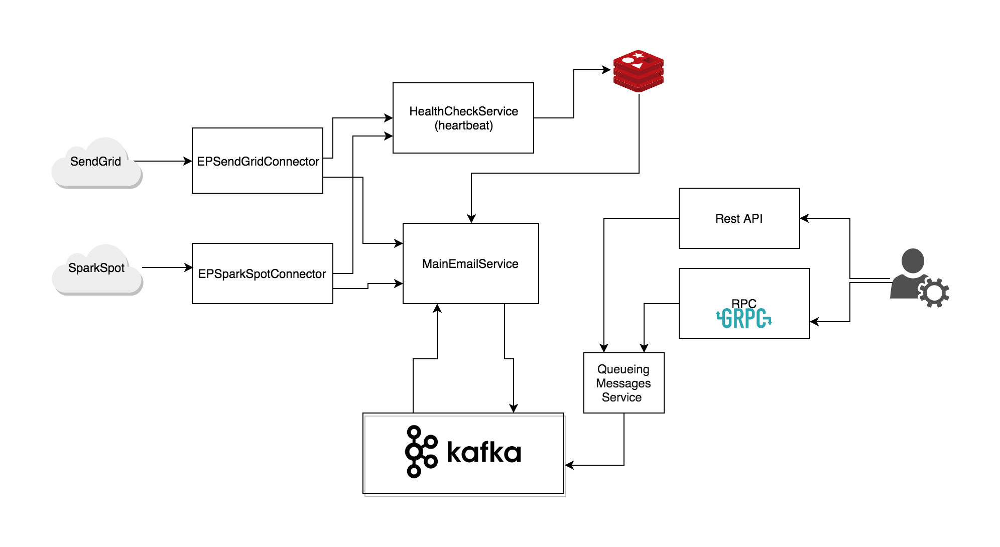

# AKEmailService 

Email Service

# The Problem Defention
Create a service that accepts the necessary information and sends emails. It should provide an abstraction between two different email service providers. If one of the services goes down, your service can quickly failover to a different provider without affecting your customers.

	Example Email Providers:
		SendGrid - Simple Send Documentation
		Mailgun - Simple Send Documentation
		SparkPost - Developer Hub
		Amazon SES - Simple Send Documentation

# The Solution

## Clarifications
Based on this requirement I can the goal is don't affect the customer by failover the provider to others when it goes down

* The Main Requirement here is to do the service
    * High Available 
    * High Reliability
		
#### Questions 
* Who is the user of this service 
* How the user interacts with the service 
* What is the latency of sending email
* Should the service be synchronous or Asynchronous service
* Is there any priority of using email providers?
* What Happen when a provider goes down?
    * Failover to the other 
        * what happens when old provider come back 
        * what happens when the new provider go down

#### Simple Interface 
```
send_email(email_message)

EmailMessage{
	from_email:"",
	to_emails: [],
	subject:""
	body:"<with html template or just text>"
}
```
#### Trade-offs
1. First Trade-off it the Synchronization of the service 
    Two option Synchronous and Asynchronous service
    * Synchronous
        * User send action and take the response 
        * How much time user will wait until send email
        * what happen when fail from using one provider and failover to other
    * Asynchronous 
    	* Send the event and go 
    	* no proper response to the user on realtime 
2. Second How to over this service 
	this is based on the type of user ant the type of scale and the services that will use it 
	1. Reast API
	2. RPC Endpoint with server/client
	3. Pub/sub Event based service 
#### Service 
To make the Failover service that is send Email 

### Main sending email service
```
	register all providers to services List as services with its status
    call send_email()
        validate message
        msg = build the EmailMessage 
        provider = pick_provider_service()
        if provider not exist:
            no service is up
            push to queue or storage for later send
        res = provider.send(msg)
        if res is Ok:
            return Good and done 
        if res is user related error(like bad email, or very big content):
            back to user
        if res is Reqest error(like bad Key, or request):
            notify me on slack and log
        if res is overLimt error:
            mark service status as overlimt for now 
        if res is provider related error:
            mark provider service as DOWN
            then 
            recursively send_email()

    pick_provider_service
    	for each provider service in the reigestered services
    		if status is up
    			return the service

```
### Healthcheck (heart beating) service 
but with this algorithm, there is something that needs to be taken into consideration
when service goes down, this algorithm will mark it and failover 
but what happens when it comes back to be running 
or when all services go down and no clue of its status 
So I should keep track Healthcheck (heart beating) service for those providers 
Its background service that is running periodacly with small intervals to check the status of the Email providers service (Without using the main APIs to not pay more for this requests or overlimit my limit on the provider)

### Redis 
To make this operate well, we need to store the status of the providers 
produced by HealthCheck or the Main service itself and be very fast accessible from the sending email service 
So I used Redis to be this kind of fast and small distributed cache


	Backend Service with it's API docs and clients 
## High level architecture




## Alternative 


## What Next 

## Components 
1. Email Provider Connectors 
	1. sendgrid connector
	2. sparkposr connector
2. Main Email Service 
3. Health check Service 
4. Rest API Service 
5. RPC Service Server/client
6. some tests
7. API docs
8. Docker/Docker-compose and running scripts


### Email Providers 
	* sendgrid
	* sparkpost

# Getting Started

## steps 
* build docker image 
* Run docker compose 
	* Run Redis container
	* Run Rest API Service 
	* Run RPC Service
	* Run Health check(heartbeat) searvice 
* User Rest API
	* check api docs /apidocs
	* /api/auth to get token
	* /api/email [POST] with JWT token
* Use RPC client


## Init
* clone this repo
* Code Dir Tree
	```
	./
		MainService/    <Your main Flask  code dir> 
		Readme.md
		docker-entrypoint.sh
		..
	```
## Config 
#### Env Variable 
create file ak_variables.env
OR just add my ak_variables.env which i sent 
```
AK_APP_ENV=<pro  or dev>
BASE_HOST=<HOSTIP OR local host>
SENDGRID_API_KEY=<YOUR_API_KEY>
SPARKPOST_API_KEY=<YOUR_API_KEY>
AK_API_JWT_SECRET_KEY=<Choose SECRET Key to used to auth and generate JWT Token>
```
#### Email Providers connectors 
```
	sendgrid:
	    API_KEY: "<YOUR_API_KEY>"
	    STATUS_URL: "http://status.sendgrid.com/api/v2/summary.json"
	    COMPONENT_NAME: "Mail Sending"
	sparkpost:
	    API_KEY: "<YOUR_API_KEY>"
	    STATUS_URL: "https://status.sparkpost.com/api/v2/summary.json"
	    COMPONENT_NAME: "Transmissions API"
```
## Running Pre Requirements
#### Option 1 (Recommended)
	* Docker
	* Docker-compose
#### Option 2
	* Redis server 
		* REDIS_HOST = "ak-redis"
		* REDIS_PORT = 6379
	* Python 3.X
	* pip and python requirements in requirements.txt
		```
			pip install --no-cache-dir -r requirements.txt
		```
	* Run each service separately 

## Build

* Build The images
```
    cd $PWD
	sh build_docker_image.sh 

```
* OR Pull the image from Docker hub 
```
    cd $PWD
	docker pull ahmedkammorah/ak_email_service 

```
## Run
#### Start Container On (Dev Mode) 
```
	sh run_redis.sh
	sh run_ak_dev.sh
```

#### Start Container On (Pro Mode) 
```
	docker-compose up
```
## Deployment
### Services are depoyed on AWS 
* [Main API docs](http://13.58.165.80:5000/apidocs)

## Use The Demo 
### Use Rest API
* Check The API Doc 
	* [Swagger API docs](http://13.58.165.80:5000/apidocs)
* Start Login to get the JWT Token to be able to user the send API Endpoint
	* [Auth Endpoint  /api/auth ](http://13.58.165.80:5000/apidocs/#/AKAuth)
		* username: <Main user name\>
		* password: <Main Password\>
* Test the token on the protected endpoint
	* [Protected test Endpoint /api/protected](http://13.58.165.80:5000/apidocs/#/AKAuth/get_api_protected)
* Use the send Eamil endpoint
	* [Send Email Endpoint /api/email [POST]](http://13.58.165.80:5000/apidocs/#/AKEmailServiceAPI/sendEmail)
### Use RPC client
If the the service that will use this service is 
* Python 
```
	cd /app/MainService/rpc
	cp ak_email_service_client.py     # with its depandancies 
	if the other service is Python 
```
* other language 
Use the RPC stub to connecto to my RPC servicer 

RPC_SERVER :  13.58.165.80:50051


# Author
* Ahmed Kammroah 
	* [ahmedkammorah](https://github.com/AhmedKammorah) 
	* [resume](https://github.com/AhmedKammorah/my_resume_latex)
	* [LinkedIn](https://www.linkedin.com/in/ahmedkammorah/)
